# Comparaison Tools OWUI classiques vs MCP vs A2A

> Analyse des protocoles d'intégration d'outils et d'agents pour OpenWebUI v0.8.12
> et au-delà. Mis à jour avril 2026.

---

## Partie 1 — Le protocole MCP (Model Context Protocol)

### Définition

MCP est un **protocole ouvert** créé par Anthropic (novembre 2024) qui standardise
la communication entre les applications LLM et les services externes.
Il fonctionne sur une architecture **client-serveur** avec des canaux JSON-RPC 2.0 stateful.

Spec actuelle : [MCP 2025-11-25](https://modelcontextprotocol.io/specification/2025-11-25)

### Primitives du protocole

MCP définit **6 primitives** réparties entre serveur et client :

#### Côté serveur (ce que le serveur expose)

| Primitive | Rôle | Exemple |
|-----------|------|---------|
| **Tools** | Actions exécutables que le LLM peut invoquer | `browser_extract(url)` → contenu de la page |
| **Resources** | Données en lecture seule, identifiées par URI | `file:///data/rapport.pdf` → contenu du fichier |
| **Prompts** | Templates d'instructions réutilisables | "Résume ce document en 3 points" |

#### Côté client (ce que le client offre au serveur)

| Primitive | Rôle | Exemple |
|-----------|------|---------|
| **Sampling** | Le serveur demande une complétion LLM au client | Le serveur analyse des données et a besoin du LLM pour décider |
| **Elicitation** | Le serveur demande une saisie à l'utilisateur | "Dans quel fuseau horaire es-tu ?" avec validation JSON Schema |
| **Roots** | Périmètre de visibilité des ressources | Limite l'accès à un répertoire spécifique |

### Transports

| Transport | Usage | Protocole |
|-----------|-------|-----------|
| **stdio** | Local (Claude Desktop, Cursor) | stdin/stdout JSON-RPC |
| **SSE** (legacy) | Réseau, ancien format | HTTP GET (stream) + POST (messages) |
| **Streamable HTTP** (actuel) | Réseau, format recommandé | HTTP POST → SSE response |

### Cycle de vie d'une session MCP

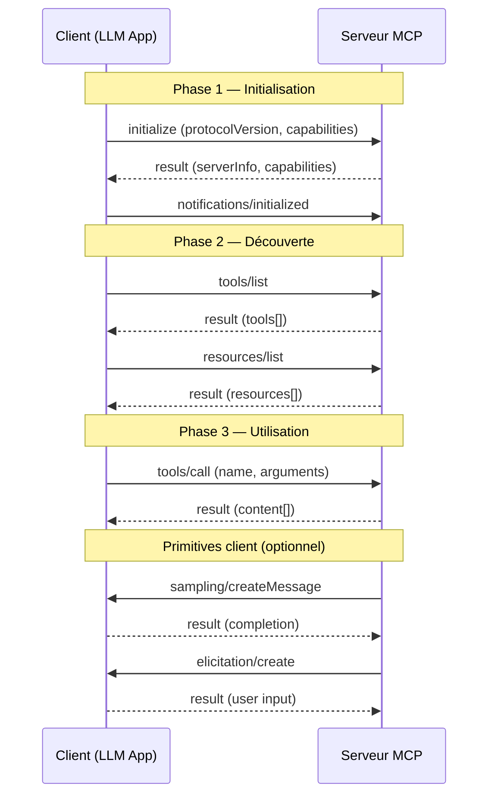

### Format des messages (JSON-RPC 2.0)

```json
// Requête
{
  "jsonrpc": "2.0",
  "id": 1,
  "method": "tools/call",
  "params": {
    "name": "tchap_search_rooms",
    "arguments": { "query": "cloud" }
  }
}

// Réponse
{
  "jsonrpc": "2.0",
  "id": 1,
  "result": {
    "content": [
      { "type": "text", "text": "- Salon Cloud (!abc:tchap.gouv.fr)" }
    ]
  }
}
```

### Nouveautés spec 2025-11-25

- **Tasks** : abstraction pour suivre le travail en cours (statut, résultats)
- **Tool calling dans sampling** : le serveur peut appeler des tools dans ses propres boucles agent
- **Parallel tool calls** : exécution concurrente de plusieurs tools
- **OAuth 2.1** : authentification standardisée pour les serveurs MCP

### Sécurité

- **DNS rebinding protection** : validation du header `Host` (bloque les services K8s internes)
- **Authorization** : OAuth 2.1, Bearer token, ou session
- **Resource Indicators** (spec juin 2025) : empêche les serveurs malveillants d'obtenir des tokens d'accès

### Limitations clés

- **Pas de contexte applicatif** dans `tools/call` : pas de champ `user`, `session`, `metadata`
- **Stateful** : chaque connexion maintient un état → complexité en microservices
- **DNS rebinding** : bloque les appels internes K8s sans patch
- **Sub-app mounting** : impossible de monter `streamable_http_app()` dans FastAPI (lifespan non propagé)

---

## Partie 2 — Le protocole A2A (Agent-to-Agent)

### Définition

A2A est un **protocole ouvert** créé par Google (avril 2025) pour la communication
**entre agents AI**. Là où MCP connecte un LLM à des outils, A2A connecte
des **agents autonomes entre eux**.

Spec actuelle : [A2A v0.3](https://a2a-protocol.org/v0.3.0/specification/)
Gouvernance : [Linux Foundation](https://www.linuxfoundation.org/press/linux-foundation-launches-the-agent2agent-protocol-project-to-enable-secure-intelligent-communication-between-ai-agents)
Supporters : 150+ organisations (Google, Salesforce, SAP, Atlassian, LangChain, etc.)

### Concepts clés

| Concept | Rôle | Équivalent MCP |
|---------|------|----------------|
| **Agent Card** | Fiche d'identité JSON de l'agent (nom, URL, capabilities, auth) | Aucun (discovery manuelle) |
| **Task** | Unité de travail stateful entre client et agent (ID unique) | Tasks (spec 2025-11) |
| **Message** | Échange conversationnel dans une Task | Pas d'équivalent |
| **Part** | Contenu typé (texte, fichier, données structurées) | `content[]` dans tool result |
| **Artifact** | Sortie produite par l'agent (document, image, données) | Pas d'équivalent |
| **TaskStatus** | État de la tâche (submitted, working, completed, failed) | Pas d'équivalent |

### Architecture

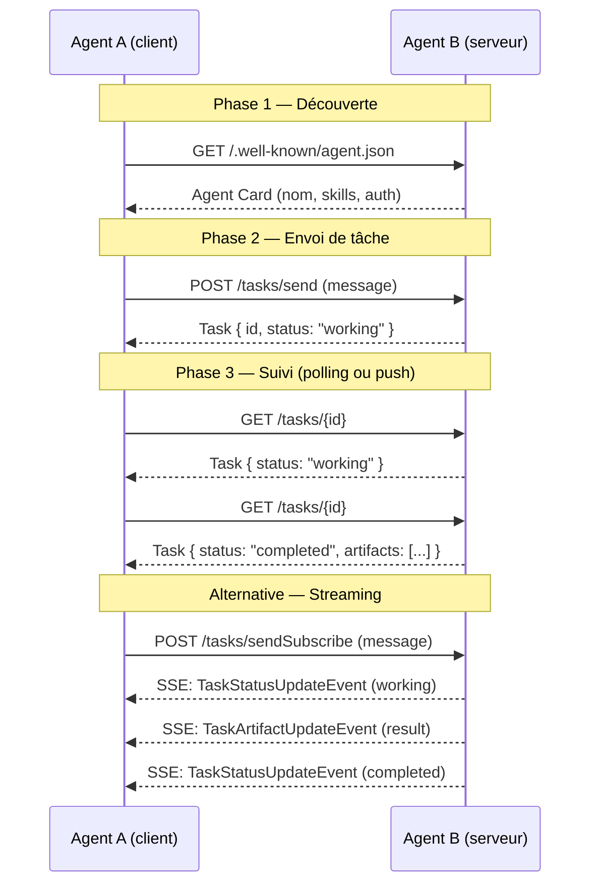

### Agent Card (découverte)

```json
{
  "name": "Tchap Reader Agent",
  "description": "Analyse de salons Tchap",
  "url": "https://tchap-reader.miraiku.svc/",
  "version": "1.0.0",
  "capabilities": {
    "streaming": true,
    "pushNotifications": true
  },
  "skills": [
    {
      "id": "search_rooms",
      "name": "Recherche de salons",
      "description": "Recherche des salons Tchap par mot-clé"
    }
  ],
  "authentication": {
    "schemes": ["bearer"]
  }
}
```

### Modes d'interaction

| Mode | Transport | Usage |
|------|-----------|-------|
| **Synchrone** | HTTP POST → réponse JSON | Tâches rapides (< 30s) |
| **Streaming** | HTTP POST → SSE | Tâches progressives (résultats partiels) |
| **Push notifications** | Webhook callback | Tâches longues (heures/jours) |
| **gRPC** (v0.3) | gRPC bidirectionnel | Communication haute performance |

### Cycle de vie d'une Task

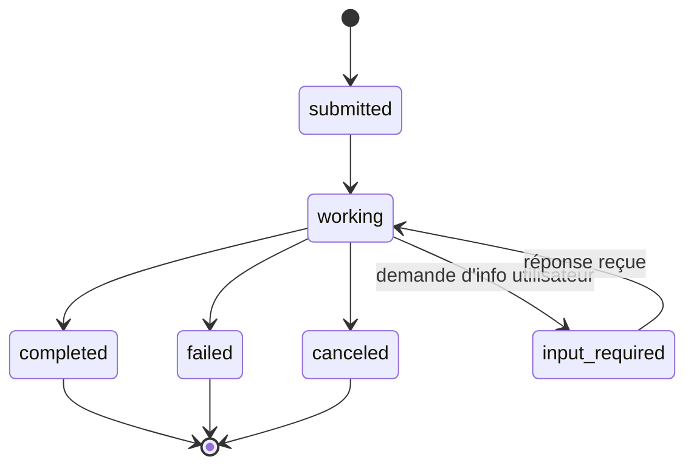

---

## Partie 3 — MCP vs A2A : positionnement

### Ils ne sont pas concurrents — ils sont complémentaires

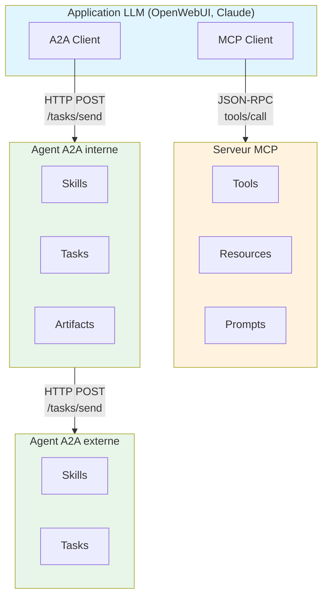

| Critère | MCP | A2A |
|---------|-----|-----|
| **Focus** | Connecter un LLM à des **outils et données** | Connecter des **agents entre eux** |
| **Paradigme** | Client-serveur (le LLM contrôle) | Pair-à-pair (les agents collaborent) |
| **Unité de travail** | Tool call (synchrone, atomique) | Task (asynchrone, stateful, longue durée) |
| **Découverte** | Manuelle (URL configurée) | Agent Card (`/.well-known/agent.json`) |
| **Contexte** | Pas de contexte dans le protocole | Message avec historique conversationnel |
| **Résultats** | `content[]` (texte/image) | Artifacts (documents, données structurées) |
| **Asynchrone** | Non (sauf Tasks spec 2025-11) | Oui (push notifications, polling, streaming) |
| **Multimodal** | Texte + images dans content | Parts typées (texte, fichier, données, video) |
| **Auth standard** | OAuth 2.1 (spec 2025-06) | OAuth 2.0, bearer, custom schemes |
| **Gouvernance** | Anthropic | Linux Foundation (Google + 150 orgs) |
| **Maturité** | Production (Claude, Cursor, OWUI) | Early adoption (v0.3, juillet 2025) |

### Exemple concret : workflow hybride MCP + A2A

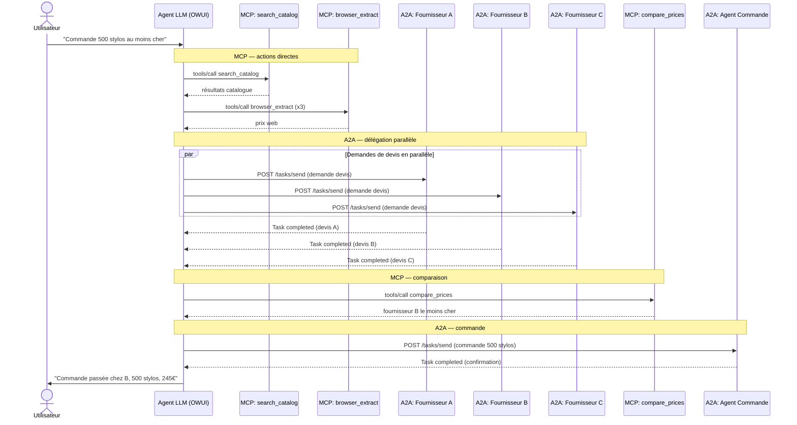

**MCP** = actions directes, outils locaux, accès données
**A2A** = délégation à des agents externes autonomes, tâches longues

---

## Partie 4 — Intégration dans notre écosystème Miraiku

### Architecture Miraiku — intégration des protocoles

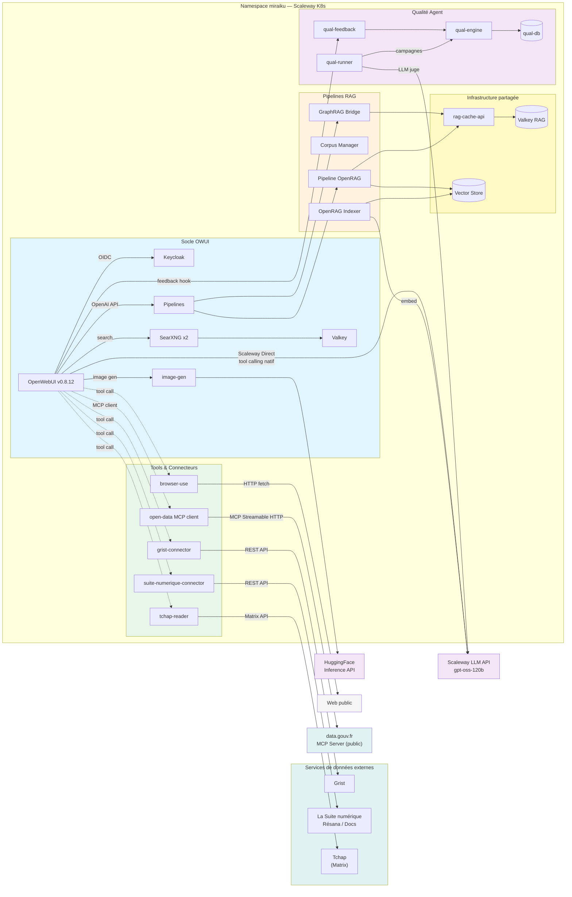

### Nouveaux composants

#### 1. RAG Cache (clé/valeur surchargeable)

Cache partagé entre les pipelines RAG pour éviter de ré-embed ou ré-indexer des données déjà traitées. Basé sur Valkey (Redis-compatible) avec une API REST pour le CRUD.

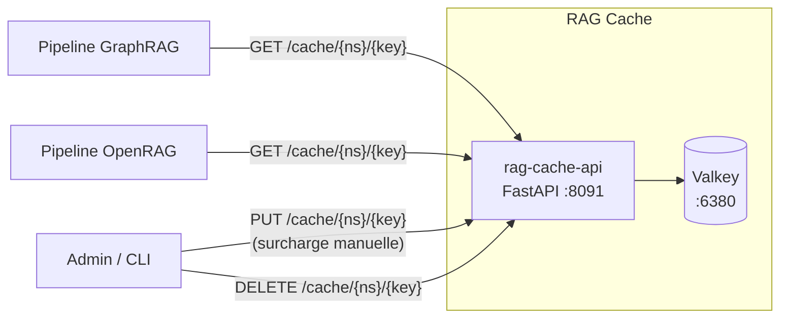

**Principes :**
- **Namespace** par pipeline : `graphrag:`, `openrag:`, `anef:`, `global:`
- **Surcharge** : un admin ou un script peut forcer une valeur via `PUT /cache/{ns}/{key}` — utile pour corriger une donnée sans ré-indexer
- **TTL configurable** par namespace (ex: `graphrag:` = 24h, `global:` = 7j)
- **Invalidation** : `DELETE /cache/{ns}/{key}` ou `DELETE /cache/{ns}/*` pour flush un namespace
- **Métriques** : hit rate, miss rate, taille par namespace

**API REST :**
```
GET    /cache/{namespace}/{key}           → valeur ou 404
PUT    /cache/{namespace}/{key}           → set/surcharge (body JSON)
DELETE /cache/{namespace}/{key}           → supprime
DELETE /cache/{namespace}                 → flush namespace
GET    /cache/{namespace}/_stats          → hit/miss/size
GET    /healthz                           → status
```

**Cas d'usage :**
- Embedding déjà calculé pour un document → cache hit, pas d'appel LLM
- Résultat de recherche GraphRAG pour une query fréquente → cache hit
- Admin qui corrige une fiche réglementaire → surcharge `anef:fiche_xyz`
- Nouveau déploiement → flush sélectif par namespace

---

#### 2. OpenRAG (pipeline RAG ouverte)

Pipeline RAG générique dans le socle, complémentaire à GraphRAG (qui est spécialisé graphe de connaissances). OpenRAG fournit un RAG classique vectoriel pour les documents ingérés.

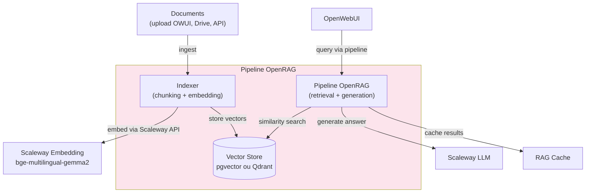

**Différence avec GraphRAG :**

| | GraphRAG | OpenRAG |
|---|---------|---------|
| **Approche** | Graphe de connaissances (entités, relations) | Vectoriel classique (chunks + embeddings) |
| **Indexation** | Lourde (extraction entités par LLM) | Légère (chunking + embedding) |
| **Requêtes** | Local (entités proches) + Global (résumé) | Similarity search top-K |
| **Cas d'usage** | Corpus structurés, questions relationnelles | Documents variés, questions factuelles |
| **Coût** | Élevé (beaucoup d'appels LLM à l'indexation) | Faible (embedding seul) |
| **Pipeline** | `graphrag_pipeline.py` (via Bridge) | `openrag_pipeline.py` (direct) |

---

#### 3. Qualité Agent (mesure et feedback)

Tooling de mesure de la qualité du système conversationnel, avec deux axes :

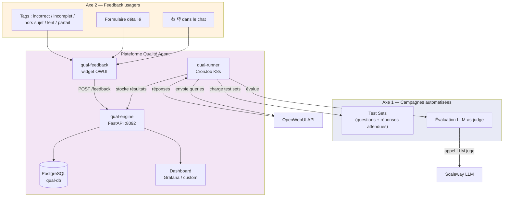

**Axe 1 — Campagnes automatisées :**

Exécution régulière (CronJob) de batteries de tests pour mesurer la qualité des réponses :

| Composant | Rôle |
|-----------|------|
| **Test Sets** | Fichiers YAML avec questions + réponses de référence + critères |
| **qual-runner** | CronJob qui envoie les questions à OWUI, collecte les réponses |
| **LLM-as-judge** | Un second LLM (ou le même) évalue la qualité de la réponse |
| **Métriques** | Relevance, faithfulness, completeness, coherence (scores 0-5) |

```yaml
# Exemple test set
- id: "qual-001"
  question: "Quels sont les documents nécessaires pour un titre de séjour ?"
  reference: "Passeport valide, photos d'identité, justificatif de domicile..."
  pipeline: "scaleway-general"
  criteria:
    - relevance: "La réponse mentionne les documents officiels"
    - completeness: "Au moins 4 documents sont listés"
    - source: "La réponse cite service-public.fr ou interieur.gouv.fr"
  tags: ["immigration", "préfecture"]
```

**Axe 2 — Feedback usagers :**

Collecte en temps réel des retours utilisateurs dans le chat :

| Signal | Mécanisme | Granularité |
|--------|-----------|-------------|
| **Pouce** (👍/👎) | Bouton natif OWUI (hook `chat/completed`) | Par message |
| **Tags** | Menu déroulant post-réponse | Par message |
| **Formulaire** | Lien dans le message ou widget latéral | Par conversation |
| **Implicite** | Régénération de réponse, abandon de conversation | Par session |

**Métriques agrégées :**

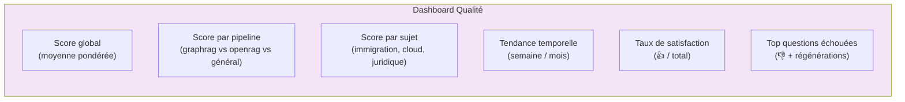

**API qual-engine :**
```
POST   /feedback                          → enregistre un feedback usager
POST   /campaigns/run                     → lance une campagne de test
GET    /campaigns/{id}/results            → résultats d'une campagne
GET    /metrics/global                    → score global + tendance
GET    /metrics/pipeline/{pipeline_id}    → score par pipeline
GET    /metrics/topics                    → score par sujet
GET    /metrics/failures                  → top questions échouées
GET    /healthz                           → status
```

---

#### 4. Grist Connector (accès données tableur collaboratif)

Tool ou serveur MCP pour interroger les données stockées dans [Grist](https://www.getgrist.com/) (tableur collaboratif open source, alternative à Airtable/Google Sheets).

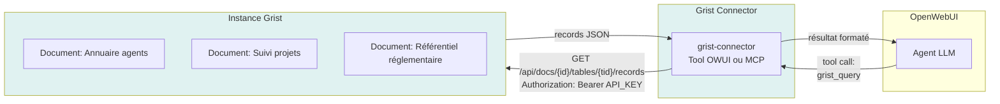

**Tools exposés :**

| Tool | Description |
|------|-------------|
| `grist_list_documents` | Liste les documents accessibles dans un workspace |
| `grist_list_tables` | Liste les tables d'un document |
| `grist_query_records` | Récupère les enregistrements d'une table (avec filtres optionnels) |
| `grist_search` | Recherche textuelle dans une table |
| `grist_get_record` | Récupère un enregistrement par ID |
| `grist_sql_query` | Exécute une requête SQL sur un document (si supporté) |

**API Grist utilisée :**
```
GET  /api/orgs                                → liste des organisations
GET  /api/orgs/{orgId}/workspaces             → liste des workspaces
GET  /api/docs/{docId}/tables                 → liste des tables
GET  /api/docs/{docId}/tables/{tableId}/records → enregistrements
GET  /api/docs/{docId}/sql?q={query}          → requête SQL
```

**Configuration :**
```bash
GRIST_API_URL=https://grist.mon-domaine.fr/api    # URL instance Grist
GRIST_API_KEY=xxxxxxxxx                             # API key (Profile Settings)
GRIST_DEFAULT_DOC_ID=xxxxxxxx                       # Document par défaut (optionnel)
```

**Implémentation recommandée :**
- **Court terme** : Tool OWUI classique (Python en DB) — fonctionne maintenant
- **Moyen terme** : Serveur MCP basé sur [nic01asFr/mcp-server-grist](https://github.com/nic01asFr/mcp-server-grist) — quand la compatibilité OWUI/MCP sera résolue
- **Alternative** : le MCP server [gwhthompson/grist-mcp-server](https://github.com/gwhthompson/grist-mcp-server) (TypeScript, 22 tools) si on passe sur un client MCP compatible

---

#### 5. Open Data MCP Client (data.gouv.fr)

Client MCP qui se connecte au [serveur MCP officiel de data.gouv.fr](https://github.com/datagouv/datagouv-mcp) — le premier serveur MCP national d'open data au monde, lancé par Etalab/DINUM en février 2026.

**Instance publique :** `https://mcp.data.gouv.fr/mcp` — accès libre, sans API key, lecture seule.

**Tools exposés par le serveur MCP data.gouv.fr :**

| Tool | Description |
|------|-------------|
| `search_datasets` | Recherche de jeux de données par mots-clés (74 000+ datasets) |
| `get_dataset_info` | Métadonnées détaillées d'un dataset (organisation, tags, licence, dates) |
| `list_dataset_resources` | Liste les fichiers d'un dataset (format, taille, URL de téléchargement) |
| `get_dataset_metrics` | Statistiques mensuelles (visites, téléchargements) |

**Intégration dans Miraiku :**
- **Configuration OWUI** : ajouter `https://mcp.data.gouv.fr/mcp` comme Tool Server dans Admin → Settings → Tool Servers
- **Aucun déploiement** nécessaire : le serveur est public et hébergé par data.gouv.fr
- **Validé** : fonctionnel en démo — le serveur MCP data.gouv.fr est compatible avec les clients MCP actuels
- Le blocage MCP observé sur notre instance OWUI est donc spécifique à notre configuration (DNS rebinding, version SDK) — le protocole lui-même fonctionne

**Exemple d'usage :**
```
Utilisateur : "Quelles données ouvertes existent sur les préfectures ?"
→ search_datasets("préfectures")
→ Résultats : annuaire des préfectures, horaires, coordonnées, etc.

Utilisateur : "Télécharge le CSV des coordonnées"
→ list_dataset_resources(dataset_id)
→ URL du fichier CSV
```

Sources : [GitHub datagouv/datagouv-mcp](https://github.com/datagouv/datagouv-mcp) | [Blog data.gouv.fr](https://www.data.gouv.fr/posts/experimentation-autour-dun-serveur-mcp-pour-datagouv)

---

#### 6. Connecteur La Suite numérique (Résana / Docs DINUM)

Tool pour accéder aux fichiers et documents de [La Suite numérique](https://lasuite.numerique.gouv.fr/) de la DINUM — l'espace de travail souverain des agents de l'État.

**Services de La Suite accessibles :**

| Service | Usage | API |
|---------|-------|-----|
| **Résana** | Stockage, co-édition, espaces collaboratifs | REST API Résana |
| **Docs** | Documents collaboratifs (alternative Google Docs) | REST API Docs |
| **France Transfert** | Envoi de fichiers volumineux (jusqu'à 20 Go) | API France Transfert |
| **Messagerie** | Webmail souverain | IMAP/API |

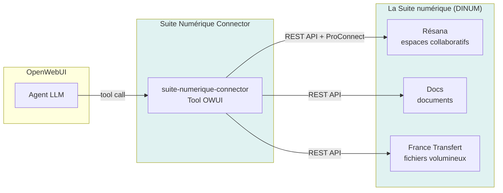

**Tools exposés :**

| Tool | Description |
|------|-------------|
| `suite_list_spaces` | Liste les espaces Résana accessibles par l'utilisateur |
| `suite_list_files` | Liste les fichiers d'un espace ou dossier Résana |
| `suite_read_document` | Lit le contenu d'un document (texte, PDF, tableur) |
| `suite_search_files` | Recherche de fichiers par nom ou contenu |
| `suite_download_file` | Télécharge un fichier pour analyse |
| `suite_get_shared_link` | Récupère un lien de partage France Transfert |

**Authentification :**
- Via **ProConnect** (SSO interministériel) — le token de session OWUI/Keycloak peut être forwardé
- Ou via **API key** Résana pour un accès service-à-service

**Configuration :**
```bash
SUITE_RESANA_API_URL=https://resana.numerique.gouv.fr/api
SUITE_DOCS_API_URL=https://docs.numerique.gouv.fr/api
SUITE_AUTH_MODE=proconnect    # ou api_key
SUITE_API_KEY=xxxxxxxxx       # si mode api_key
```

---

### État actuel (avril 2026)

| Service | MCP | A2A | Tools OWUI | Pipeline | Cache RAG |
|---------|-----|-----|------------|----------|-----------|
| tchap-reader | Endpoint `/mcp` :8088 — non fonctionnel avec OWUI | Non | Oui (3 tools en DB) | Non | Non |
| browser-skill | Endpoint `/mcp` :8088 — non fonctionnel avec OWUI | Non | Oui (1 tool + 1 filter en DB) | Non | Non |
| graphrag bridge | Non | Non | Non | Oui (pipeline custom) | **À brancher** |
| anef | Non | Non | Non | Oui (pipeline custom) | **À brancher** |
| image-gen (HF) | Non | Non | Non | Via config OWUI native | Non |
| **openrag** | Non | Non | Non | **À créer** | **À brancher** |
| **rag-cache** | Non | Non | Non | N/A (infra) | **À créer** |
| **grist-connector** | Non (MCP existants dispo) | Non | **À créer** | Non | Non |
| **open-data (data.gouv.fr)** | **Serveur public existant** (`mcp.data.gouv.fr`) — **validé en démo** | Non | Fallback REST possible | Non | Non |
| **suite-numerique** | Non | Non | **À créer** | Non | Non |
| **qual-engine** | Non | Non | **À créer** (tool feedback) | Non | Non |

### Roadmap suggérée

**Court terme** (maintenant) :
- Utiliser les **tools OWUI classiques** en DB pour tchap et browser-skill
- Brancher le **modèle Scaleway direct** dans OWUI pour le tool calling natif
- Garder les **pipelines** pour graphrag et anef (logique métier custom)
- Déployer le **RAG Cache** (Valkey + API) — utile immédiatement pour GraphRAG
- Mettre en place le **feedback usagers** (👍/👎 → qual-engine)

**Moyen terme** :
- Créer la **pipeline OpenRAG** (vectoriel classique, complémentaire à GraphRAG)
- Brancher les pipelines existantes sur le **RAG Cache**
- Lancer les **campagnes de test automatisées** (qual-runner + LLM-as-judge)
- Migrer tchap-reader et browser-skill vers **MCP** (quand OWUI le supporte)
- Ajouter le support **Elicitation** pour les interactions utilisateur

**Long terme** (quand A2A sera mature) :
- Transformer les services en **agents A2A** avec Agent Cards
- **Collaboration inter-agents** : tchap-reader ↔ browser-skill ↔ openrag
- **Push notifications** pour les tâches longues (indexation, sync bulk)
- **Discovery** automatique via `/.well-known/agent.json`
- **Dashboard qualité** unifié (Grafana ou custom) avec alertes de dégradation

---

## Partie 5 — Tools OWUI classiques (rappel)

Les tools classiques reçoivent **beaucoup de contexte** via les variables magiques `__user__` et `__metadata__` :

```python
class Tools:
    async def my_tool(self, param: str, __user__: dict, __metadata__: dict):
        # __user__ contient : id, email, name, role, groups, ...
        # __metadata__ contient : chat_id, message_id, tool_ids, ...
```

### Comparaison du contexte transmis

| Donnée | Tools OWUI | MCP | A2A |
|--------|-----------|-----|-----|
| User ID, email, name, role | `__user__` dict | Headers HTTP (si activé) | Dans le Message (libre) |
| **Groupes utilisateur** | `__user__["groups"]` | **Non transmis** | Dans le Message (libre) |
| Chat ID, message ID | `__metadata__` | Headers HTTP (si activé) | Task ID + Message ID |
| **Fichiers uploadés** | `__metadata__["files"]` | **Non transmis** | Parts (type file) |
| **Modèle utilisé** | `__metadata__["model"]` | **Non transmis** | N/A |
| Token OAuth | `__oauth_token__` | Header `Authorization` | Auth scheme |
| Accès DB OWUI | Direct (SQLite) | Non | Non |
| **Historique conversation** | Non | Non | Oui (messages dans Task) |
| **Suivi de progression** | Non | Non | Oui (TaskStatus + streaming) |
| **Résultats structurés** | Texte libre | `content[]` | Artifacts typés |

### Types d'authentification MCP supportés par OWUI

| `auth_type` | Comportement |
|-------------|-------------|
| `bearer` | Clé statique configurée dans le tool server |
| `session` | Forward le token de session de l'utilisateur OWUI |
| `system_oauth` | Token OAuth de l'utilisateur |
| `oauth_2.1` | OAuth 2.1 géré par OWUI |
| `none` | Pas d'authentification |

### Activation du forwarding de contexte (OWUI → MCP)

```bash
ENABLE_FORWARD_USER_INFO_HEADERS=true
```

Headers envoyés : `X-OpenWebUI-User-Name`, `X-OpenWebUI-User-Id`,
`X-OpenWebUI-User-Email`, `X-OpenWebUI-User-Role`,
`X-OpenWebUI-Chat-Id`, `X-OpenWebUI-Message-Id`

---

## Sources

### MCP
- [Specification MCP 2025-11-25](https://modelcontextprotocol.io/specification/2025-11-25)
- [GitHub MCP](https://github.com/modelcontextprotocol/modelcontextprotocol)
- [MCP Features Guide — WorkOS](https://workos.com/blog/mcp-features-guide)
- [MCP Primitives — Portkey](https://portkey.ai/blog/mcp-primitives-the-mental-model-behind-the-protocol/)
- [MCP Auth Updates — Auth0](https://auth0.com/blog/mcp-specs-update-all-about-auth/)
- [One Year of MCP — Blog](https://blog.modelcontextprotocol.io/posts/2025-11-25-first-mcp-anniversary/)

### A2A
- [Announcing A2A — Google Developers Blog](https://developers.googleblog.com/en/a2a-a-new-era-of-agent-interoperability/)
- [A2A v0.3 Upgrade — Google Cloud Blog](https://cloud.google.com/blog/products/ai-machine-learning/agent2agent-protocol-is-getting-an-upgrade)
- [A2A Specification](https://a2a-protocol.org/v0.3.0/specification/)
- [GitHub A2A](https://github.com/a2aproject/A2A)
- [What is A2A — IBM](https://www.ibm.com/think/topics/agent2agent-protocol)
- [A2A Linux Foundation](https://www.linuxfoundation.org/press/linux-foundation-launches-the-agent2agent-protocol-project-to-enable-secure-intelligent-communication-between-ai-agents)
- [Developer's Guide — Google](https://developers.googleblog.com/developers-guide-to-ai-agent-protocols/)

### OWUI (analyse du code source v0.8.12)
- `open_webui/utils/middleware.py` : lignes 2460-2550 (MCP tool execution)
- `open_webui/utils/headers.py` : `include_user_info_headers()`
- `open_webui/env.py` : lignes 228-243 (env vars de forwarding)
- `open_webui/utils/tools.py` : `execute_tool_server()`
- `open_webui/utils/mcp/client.py` : `MCPClient.connect()`
