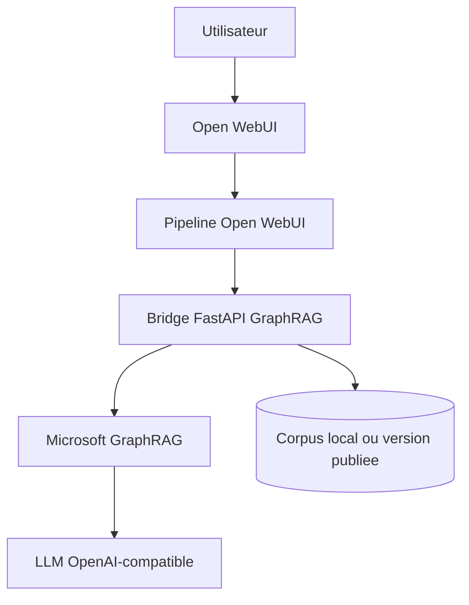
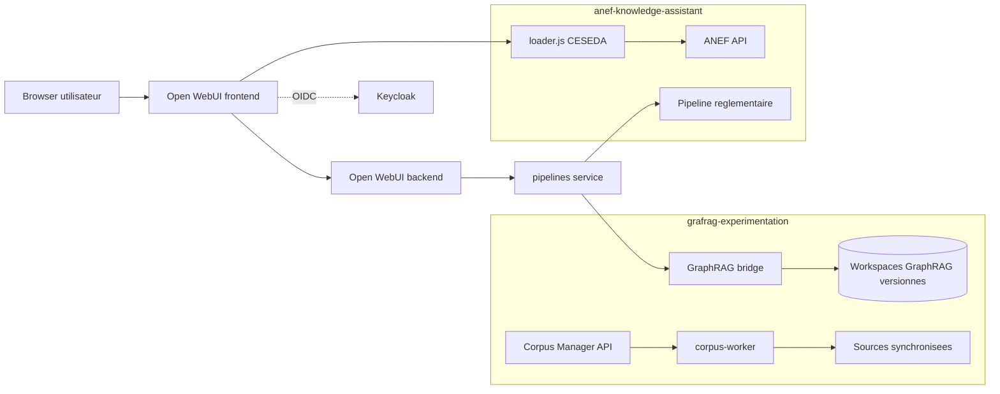
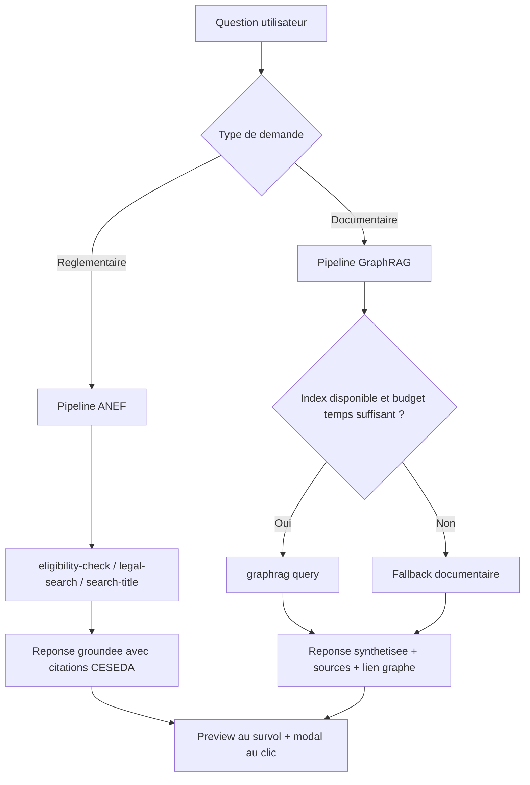

# Demo MirAI 10-15 min - version template

Template source: `/Users/etiquet/Documents/GitHub/PIP-Organization-Chart-From-Grist/data/template.ppt.pptx`

## Slide 1 - MirAI - du graphe documentaire a l'assistant reglementaire

- Demo 10-15 min | grafrag-experimentation + anef-knowledge-assistant

Notes orateur:
- Ouvrir sur l'idee d'une meme experience utilisateur pour plusieurs intelligences specialisees.
- Le message a faire passer: ce n'est pas deux demos cote a cote, c'est une plateforme d'assistants.

## Slide 2 - POURQUOI CES EXPERIMENTATIONS COMPTENT

Bloc 1:
- Intention
- Prouver qu'un chat peut devenir un assistant fiable, sourcable et actionnable.
- Tester une UX unique pour retrieval, graphe, citations et outils metier.

Bloc 2:
- Ce que montre grafrag
- GraphRAG derriere Open WebUI.
- Corpus Manager, viewer interactif, fallback, cycle de vie des corpus.

Bloc 3:
- Ce que montre ANEF
- Moteur d'eligibilite explicable.
- Citations CESEDA cliquables, legal viewer, surcouche browser legere.

Notes orateur:
- Cette slide doit sonner marketing: on parle valeur, confiance et demonstrabilite.
- Insister sur la complementarite entre exploration documentaire et decision assistee.

## Slide 3 - CE QUE PEUT FAIRE GRAFRAG-EXPERIMENTATION

Bloc 1:
- Valeur demo
- Questionner un corpus, obtenir une reponse sourcee, puis naviguer dans le graphe et la chronologie.

Bloc 2:
- Capacites clefs
- Bridge FastAPI + pipelines Open WebUI.
- Graph viewer.
- Fallback documentaire si l'index complet manque.
- Mode multi-corpus avec sync, index, publish et ACL.

Notes orateur:
- Montrer que le repo ne sert pas seulement a lancer GraphRAG, mais a operer un workflow de corpus.
- Dire explicitement que la resilience fait partie de la proposition de valeur.

## Slide 4 - CE QUE PEUT FAIRE ANEF-KNOWLEDGE-ASSISTANT

Bloc 1:
- Valeur demo
- Transformer un corpus reglementaire et un Excel metier en assistant d'eligibilite explicable.

Bloc 2:
- Capacites clefs
- API FastAPI orientee usages.
- Pieces, conditions, wizard, FAQ, legal search.
- Viewer CESEDA local.
- Reponses groundees avec citations cliquables et preview au survol.

Notes orateur:
- Positionner ANEF comme une preuve d'usage vertical a forte valeur metier.
- Le point fort n'est pas seulement la recherche, mais l'explication et la vigilance.

## Slide 5 - POURQUOI LES DEUX REPOS ENSEMBLE SONT INTERESSANTS

Bloc 1:
- Experience commune
- Open WebUI, SSO Keycloak, aliases MirAI, pipelines et surface conversationnelle partages.

Bloc 2:
- Architecture et garde-fous
- Repos separes, responsabilites claires, redeploiement partage, reprovisioning des modeles et du loader.js.

Bloc 3:
- Synthese
- Une plateforme modulaire ou chaque assistant specialise peut evoluer sans casser l'experience commune.

Notes orateur:
- C'est la slide d'architecture racontee en langage produit.
- Expliquer que le choix de deux repos permet d'accelerer sans tout coupler.

## Schemas Mermaid d'appui

### Architecture GraphRAG simplifiee

Schema directement inspire du README global pour expliquer le trajet d'une question jusqu'a la reponse sourcee.

### Topologie partagee des deux repositories

Vue d'architecture mutualisee quand `grafrag-experimentation` et `anef-knowledge-assistant` ciblent la meme instance Open WebUI.

### Fonctionnement de la requete et des garde-fous

Le point important a expliciter pendant la demo: le systeme privilegie la continuite de service et la lisibilite des reponses.

## Slide 6 - FINALITES ET AMBITION DE LA DEMO

Bloc 1:
- Finalites
- Montrer une experience complete: poser une question, voir les sources, naviguer, comprendre et agir.
- Montrer aussi que le systeme reste presentable meme quand tout n'est pas parfait.

Bloc 2:
- Ambition
- Prouver qu'Open WebUI peut devenir une couche d'experience commune pour plusieurs moteurs IA specialises, du graphe documentaire au conseil reglementaire.

Notes orateur:
- Ne pas survendre l'instantane: l'ambition est la plateforme demonstrable et industrialisable.
- Cette slide sert de transition avant la demo live.

## Slide 7 - DEROULE DE DEMO ET TESTS

Bloc 1:
- 1. Ouvrir Open WebUI et presenter les modeles MirAI.
- 2. Prompt GraphRAG: chronologie de la guerre de Cent Ans et batailles pivots.
- 3. Ouvrir le graph viewer pour montrer noeuds, relations et lecture chronologique.
- 4. Montrer le workflow Corpus Manager: sync > index > publish, ou l'expliquer si l'index tourne encore.
- 5. Prompt ANEF: CST salarie - L.421-1, pieces, conditions et vigilance.
- 6. Survoler une citation CESEDA, ouvrir la modale, puis conclure sur la valeur plateforme.

Notes orateur:
- Si le mode multi-corpus est actif, prefixer le prompt GraphRAG avec [[corpus:<id>]].
- Si l'index GraphRAG n'est pas fini, assumer le fallback comme une preuve de resilience.
- Terminer en rappelant les limites: indexation longue, aliases rejouables, validation humaine indispensable sur ANEF.

## Slide 8 - FEEDBACK, STRATEGIE DE PROMPT ET ENSEIGNEMENTS CLES

Bloc 1:
- Feedback a rechercher
- Confiance grace aux citations.
- Navigation entre chat, graphe et viewer juridique.
- Sensation de rapidite meme quand l'index n'est pas parfait.

Bloc 2:
- Strategie de prompt
- GraphRAG: demander chronologie, acteurs, comparaisons, contexte.
- Multi-corpus: prefixer [[corpus:<id>]] si necessaire.
- ANEF: demander pieces, conditions, base legale et points de vigilance dans une meme requete.

Bloc 3:
- Enseignements cles
- La resilience compte plus que la perfection.
- Le fallback et les timeouts protegent l'experience.
- Un loader.js leger et des scripts de reprovisioning valent mieux qu'un fork frontal lourd.
- La validation humaine reste indispensable sur le reglementaire.

Notes orateur:
- Cette slide permet de finir avec une lecture mature du systeme: valeur, bon usage, et limites assumees.
- Les lessons learned viennent surtout du README global: fallback, timeouts, reprovisioning, separation des repos, et webui.db volatil.
