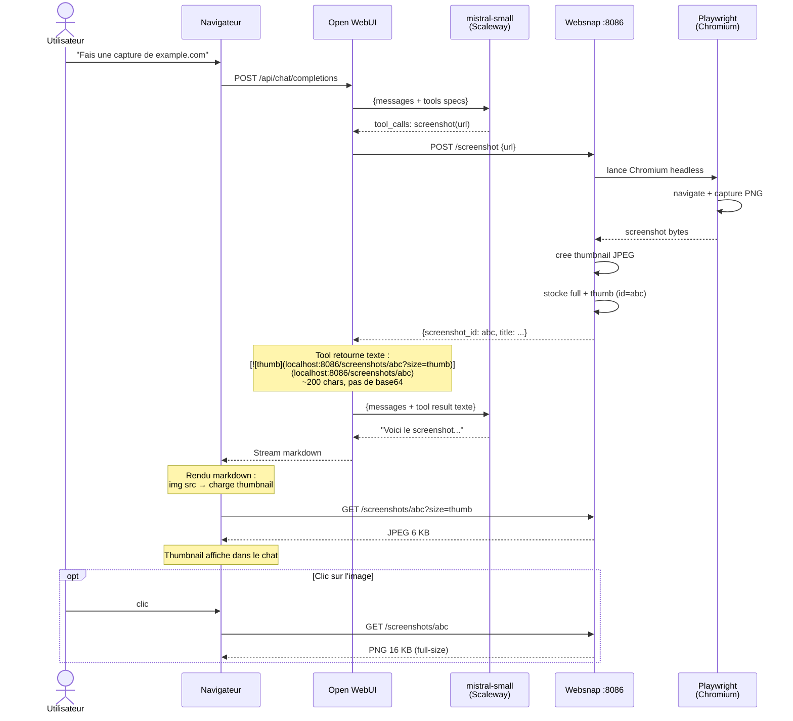

# Screenshot Tool — Architecture et contraintes

## Objectif

Permettre a un utilisateur de demander dans Open WebUI :

> "Fais une capture d'ecran de https://www.gouvernement.fr"

Et recevoir dans le chat :
1. Un **apercu visuel** (thumbnail cliquable)
2. Un **lien vers l'image en taille reelle**
3. Une **description textuelle** generee par le LLM

---

## La chaine technique

```
Utilisateur → Open WebUI → LLM (mistral-small) → Tool screenshot → Websnap API → Playwright/Chromium
                                                                          ↓
                                                                   Screenshot PNG
                                                                          ↓
                                                              Stocke en memoire (full + thumb)
                                                                          ↓
                                                              Retourne texte + URLs au LLM
                                                                          ↓
                                                              LLM genere la reponse avec le lien
                                                                          ↓
                                                              Le navigateur de l'utilisateur
                                                              rend le thumbnail comme image
                                                              et le lien ouvre le full-size
```

---

## Le probleme fondamental

Open WebUI fonctionne ainsi pour les tools :

1. Le LLM decide quel tool appeler (via native `tool_calls`)
2. Open WebUI execute le tool Python cote serveur
3. **Le resultat du tool est reinjecte dans le contexte du LLM** comme message `role: tool`
4. Le LLM genere sa reponse finale en incluant le resultat du tool

L'etape 3 est le goulot d'etranglement : **tout ce que le tool retourne est tokenize et envoye au LLM**. Si le tool retourne une image base64 de 400 KB, ca fait ~100 000 tokens injectes dans le prompt — et le LLM a une fenetre de contexte limitee (32k-131k tokens).

### Ce qui ne marche pas

| Approche | Pourquoi ca echoue |
|---|---|
| Retourner le PNG base64 inline | 400 KB = 100k tokens → depasse le contexte → `max_tokens = -178k` |
| Retourner un thumbnail base64 | Le LLM le recopie en texte brut dans sa reponse au lieu de le rendre comme image |
| Utiliser `event_emitter` type `message` | Le contenu emis est reinjecte dans le contexte du tour suivant → meme overflow |
| Utiliser `event_emitter` type `citation` | Ne supporte pas les images |

### Ce qui marche

**Approche v1 (markdown URLs)** : Le tool retourne des URLs en markdown. Le LLM recoit ~200 caracteres de texte. Le navigateur charge les images. Fonctionne mais le comportement varie entre modeles (certains reecrivent ou omettent le markdown).

**Approche v1.1 (HTMLResponse + context)** : Le tool retourne un tuple `(HTMLResponse, context_dict)`. Le HTML est rendu dans un iframe sandbox (le LLM ne le voit pas). Le LLM recoit un dict JSON compact (~150 tokens). Cette approche est portable entre modeles car le LLM n'a pas a generer de markdown image — il repond en langage naturel a partir de metadonnees structurees.

---

## Architecture de la solution

### Cote serveur (Websnap API — FastAPI + Playwright)

```
websnap :8086
├── POST /screenshot          ← capture le screenshot
│   ├── Playwright lance Chromium headless
│   ├── Navigate vers l'URL
│   ├── Capture screenshot PNG
│   ├── Cree un thumbnail JPEG (800px, quality 60)
│   ├── Stocke full + thumb en memoire (LRU, TTL 10 min)
│   └── Retourne {screenshot_id, title, description, ...}
│
├── GET /screenshots/{id}           ← sert le PNG full-size
└── GET /screenshots/{id}?size=thumb  ← sert le JPEG thumbnail
```

**Contrainte importante : 1 seul worker uvicorn.** Le store est en memoire Python (dict). Avec 2+ workers, chaque worker a son propre espace memoire : le POST stocke dans le worker A, le GET arrive sur le worker B → 404.

### Cote tool (openwebui_tool.py — execute dans Open WebUI)

Le tool utilise le pattern **`HTMLResponse + context`** d'Open WebUI (v1.1+) :

1. Appelle `POST http://host.docker.internal:8086/screenshot` (URL interne Docker)
2. Recoit le `screenshot_id`, `title`, `description`
3. Construit des URLs **publiques** (accessibles depuis le navigateur de l'utilisateur) :
   - `http://localhost:8086/screenshots/{id}?size=thumb` (thumbnail)
   - `http://localhost:8086/screenshots/{id}` (full-size)
4. Retourne un **tuple** `(HTMLResponse, context)` :
   - **`HTMLResponse`** : une carte HTML riche (thumbnail cliquable, titre, lien full-size) rendue dans un **iframe sandbox** dans le chat — le LLM ne la voit jamais
   - **`context`** : un dict JSON compact transmis au LLM comme resultat du tool

```python
# Ce que le LLM recoit (~150 tokens) :
{
  "status": "success",
  "source_url": "https://example.com",
  "page_title": "Example Domain",
  "thumbnail_url": "http://localhost:8086/screenshots/abc?size=thumb",
  "full_image_url": "http://localhost:8086/screenshots/abc",
  "caption": "Capture d'ecran de Example Domain"
}
```

Cette approche est **portable entre modeles** (Mistral Small, Qwen, gpt-oss) car le LLM n'a besoin ni de generer du markdown image, ni de recopier des URLs — il repond en langage naturel a partir du contexte JSON.

### Cote client (navigateur)

Open WebUI rend le HTMLResponse dans un iframe sandbox. Le navigateur :
1. Affiche la carte screenshot directement dans le chat (thumbnail, titre, lien)
2. Le clic sur le thumbnail ouvre le full-size dans un nouvel onglet

**Le LLM ne voit jamais l'image ni le HTML.** Il ne recoit que le contexte JSON.

---

## Les deux URLs (interne vs publique)

Le tool s'execute **dans le container Open WebUI**. Les services Docker communiquent via le reseau `owui-net`. Mais l'utilisateur est dans son **navigateur** sur la machine hote.

| Contexte | URL Websnap | Pourquoi |
|---|---|---|
| Tool → Websnap API | `http://host.docker.internal:8086` | Communication container-to-host |
| Navigateur → Websnap | `http://localhost:8086` | L'utilisateur accede via le port mappe |

Le tool a deux parametres configures dans ses Valves :
- `base_url` = `http://host.docker.internal:8086` (appels API internes)
- `public_url` = `http://localhost:8086` (URLs dans le markdown pour le navigateur)

---

## Diagramme de sequence complet



---

## Contraintes et limites

### TTL du store (10 minutes)
Les screenshots sont stockes en memoire avec un TTL de 10 minutes. Apres expiration, les URLs retournent 404. Dans un chat, les images disparaissent si l'utilisateur recharge la page apres 10 min.

**Evolution possible** : persister sur disque ou dans un bucket S3.

### 1 worker uvicorn
Le store in-memory impose un seul process. Si le service doit scaler, il faut passer a Redis ou un stockage partage.

### Taille des screenshots
Les sites modernes produisent des screenshots de 1-5 MB en PNG. Le thumbnail JPEG (800px, quality 60) fait typiquement 5-30 KB. Le full-size est servi tel quel.

### Playwright dans Docker
L'image Docker `Dockerfile.browser` (~1.5 GB) inclut Chromium. L'image legere `Dockerfile` (~400 MB) ne supporte pas les screenshots (extraction texte uniquement).

---

## Fichiers concernes

| Fichier | Role |
|---|---|
| `owuitools-websnap/app/api.py` | Endpoints `/screenshot`, `/screenshots/{id}`, store in-memory |
| `owuitools-websnap/app/openwebui_tool.py` | Tool OWUI : appelle l'API, construit le markdown avec URLs |
| `owuitools-websnap/app/browser_fallback.py` | Playwright : navigation + capture |
| `owuitools-websnap/docker/Dockerfile.browser` | Image Docker avec Chromium (1 worker) |
| `owuicore-main/scripts/ensure_tools.py` | Enregistre le tool dans la DB Open WebUI |
| `owuicore-main/docker-compose.yml` | Config OWUI : `DIRECT_TOOL_CALLING=true`, `DEFAULT_MODELS=mistral-small` |
